# ResPredAI

## Antimicrobial resistance predictions via artificial intelligence models

[](https://pypi.org/project/respredai/)
[](https://www.python.org/downloads/)

[](https://opensource.org/licenses/MIT)
[](https://doi.org/10.1038/s41746-025-01696-x)

Implementation of the pipeline described in:

> Bonazzetti, C., Rocchi, E., Toschi, A. _et al._ Artificial Intelligence model to predict resistances in Gram-negative bloodstream infections. _npj Digit. Med._ **8**, 319 (2025). https://doi.org/10.1038/s41746-025-01696-x

<p align="center">
  
</p>

<p align="center">
  <strong><a href="https://ettorerocchi.github.io/respredai-website/">Website</a></strong> |
  <strong><a href="https://ettorerocchi.github.io/ResPredAI/">Documentation</a></strong> |
  <strong><a href="#installation">Installation</a></strong> |
  <strong><a href="#quick-start">Quick Start</a></strong> |
  <strong><a href="#pipeline-overview">Pipeline Overview</a></strong> |
  <strong><a href="#cli-commands">CLI Commands</a></strong> |
  <strong><a href="#citation">Citation</a></strong>
</p>

<p align="center">
  <em>A reproducible machine learning framework designed to accelerate clinical decision-making by predicting antimicrobial resistance patterns from patient data.</em>
</p>

## Links

- **[Project Website](https://ettorerocchi.github.io/respredai-website/)** - Overview of the project, original paper, and related work
- **[Documentation](https://ettorerocchi.github.io/ResPredAI/)** - Installation guides, CLI reference, tutorials, and API documentation

## Installation

Install from PyPI:

```bash
pip install respredai
```

Or install from source:

```bash
git clone https://github.com/EttoreRocchi/ResPredAI.git
cd ResPredAI
# For development (includes pytest)
pip install -e ".[dev]"
```

## Testing the Installation

Verify the installation:

```bash
respredai --version
```

## Quick Start

### 1. Create a configuration file

```bash
respredai create-config my_config.ini
```

### 2. Edit the configuration file

Edit `my_config.ini` with your data paths and parameters:

```ini
[Data]
data_path = ./data/my_data.csv
targets = Target1,Target2
continuous_features = Feature1,Feature2,Feature3

[Metadata]
# group_column = PatientID  # Optional: prevents data leakage in CV
# temporal_column = collection_date  # Date column for temporal validation
# subgroup_columns = ward, sex  # Columns for subgroup performance analysis

[Pipeline]
models = LR,RF,XGB,CatBoost
outer_folds = 5
inner_folds = 3
# Repeated CV: set >1 for more robust estimates
outer_cv_repeats = 1
# Probability calibration: post-hoc calibration on best estimator
calibrate_probabilities = false
probability_calibration_method = sigmoid  # sigmoid or isotonic
probability_calibration_cv = 5
# Threshold optimization
calibrate_threshold = false
threshold_method = auto
# Threshold optimization objective: youden (default), f1, f2, cost_sensitive
threshold_objective = youden
# Cost weights for cost_sensitive objective (VME = false susceptible, ME = false resistant)
vme_cost = 1.0
me_cost = 1.0
# Confidence level for bootstrap CIs (between 0.5 and 1.0, default: 0.95)
confidence_level = 0.95
# Number of bootstrap resamples for CIs (>= 100, default: 1000)
n_bootstrap = 1000

[Uncertainty]
# Margin around threshold for flagging uncertain predictions (0-0.5)
margin = 0.1

[Reproducibility]
seed = 42

[Log]
verbosity = 1
log_basename = respredai.log

[Resources]
n_jobs = -1

[ModelSaving]
enable = true
compression = 3

[Preprocessing]
ohe_min_frequency = 0.05

[Imputation]
method = none
strategy = mean
n_neighbors = 5
estimator = bayesian_ridge

[Output]
out_folder = ./output/

[Validation]
# Validation strategy: cv (default), temporal (prospective-style), or both
validation_strategy = cv
# temporal_split_date = 2023-01-01  # Cutoff date (train < date, test >= date)
# temporal_split_ratio = 0.8  # Alternative: fraction for training (by date order)
```

> **Tip:** Comment out optional parameters with `#` to disable them. Empty values (e.g., `group_column =`) are treated as absent.

### 3. Run the pipeline

```bash
respredai run --config my_config.ini
```

## Pipeline Overview

> *Amber nodes indicate optional steps controlled by configuration parameters. All pipelines are executed for each model × target combination.*

### `respredai run` - Nested Cross-Validation

```mermaid
flowchart LR
    A[Configuration Loading] --> B[Data Loading & Validation]
    B --> C[OHE Template]
    C --> D{Validation Strategy}

    D -->|cv / both| E["Outer CV Loop (group-aware if configured)"]
    D -->|temporal / both| F[Temporal Split]

    E --> G["OHE (fit on train, transform test)"]
    G --> H["Scaling (fit on train, transform test)"]
    H --> I[Hyperparameter Tuning - Inner CV]
    I --> J[Calibration & Threshold]
    J --> K[Predict on Test Fold]
    K --> L[Metrics + Bootstrap CIs]
    L --> M[Subgroup Analysis]

    F --> T1["OHE (fit on train, transform test)"]
    T1 --> T2["Scaling (fit on train, transform test)"]
    T2 --> T3[Hyperparameter Tuning - Inner CV]
    T3 --> T6[Calibration & Threshold]
    T6 --> T4[Predict on Test Split]
    T4 --> T5[Metrics + Bootstrap CIs]

    M --> R[Generate Reports]
    T5 --> R
    R --> R1[Summary CSVs + HTML Report]
    R --> R2[Confusion Matrices]
    R --> R3[Calibration Curves]
    R --> R4[Feature Importance]

    style A fill:#e8e8e8,stroke:#999,color:#333
    style B fill:#e8e8e8,stroke:#999,color:#333
    style C fill:#b2ebf2,stroke:#0dafb5,color:#333
    style D fill:#ffe0b2,stroke:#f5a623,color:#333
    style E fill:#b2ebf2,stroke:#0dafb5,color:#333
    style F fill:#b2ebf2,stroke:#0dafb5,color:#333
    style G fill:#b2ebf2,stroke:#0dafb5,color:#333
    style H fill:#b2ebf2,stroke:#0dafb5,color:#333
    style I fill:#b2ebf2,stroke:#0dafb5,color:#333
    style J fill:#fff3e0,stroke:#f5a623,color:#333
    style K fill:#b2ebf2,stroke:#0dafb5,color:#333
    style L fill:#b2ebf2,stroke:#0dafb5,color:#333
    style M fill:#fff3e0,stroke:#f5a623,color:#333
    style T1 fill:#b2ebf2,stroke:#0dafb5,color:#333
    style T2 fill:#b2ebf2,stroke:#0dafb5,color:#333
    style T3 fill:#b2ebf2,stroke:#0dafb5,color:#333
    style T6 fill:#fff3e0,stroke:#f5a623,color:#333
    style T4 fill:#b2ebf2,stroke:#0dafb5,color:#333
    style T5 fill:#b2ebf2,stroke:#0dafb5,color:#333
    style R fill:#0dafb5,stroke:#098a8f,color:#fff
    style R1 fill:#0dafb5,stroke:#098a8f,color:#fff
    style R2 fill:#0dafb5,stroke:#098a8f,color:#fff
    style R3 fill:#0dafb5,stroke:#098a8f,color:#fff
    style R4 fill:#fff3e0,stroke:#f5a623,color:#333
```




### `respredai train` - Train for Deployment

```mermaid
flowchart LR
    A[Configuration Loading] --> B[Data Loading & Validation]
    B --> C[OHE on Full Data]
    C --> E[Feature Scaling]
    E --> F[Hyperparameter Tuning - Inner CV]
    F --> G[Calibration & Threshold]
    G --> H[Save Model Bundle]
    H --> I["Output: model + transformer + OHE + threshold + metadata"]

    style A fill:#e8e8e8,stroke:#999,color:#333
    style B fill:#e8e8e8,stroke:#999,color:#333
    style C fill:#b2ebf2,stroke:#0dafb5,color:#333
    style E fill:#b2ebf2,stroke:#0dafb5,color:#333
    style F fill:#b2ebf2,stroke:#0dafb5,color:#333
    style G fill:#fff3e0,stroke:#f5a623,color:#333
    style H fill:#0dafb5,stroke:#098a8f,color:#fff
    style I fill:#0dafb5,stroke:#098a8f,color:#fff
```




### `respredai evaluate` - Cross-Dataset Evaluation


## CLI Commands

### Run the pipeline

```bash
respredai run --config path/to/config.ini [--quiet]
```

Train models using nested cross-validation with the specified configuration.

📖 **[Detailed Documentation](https://ettorerocchi.github.io/ResPredAI/cli-reference/run-command.html)** - Complete guide with all configuration options and workflow details.

### Train models for cross-dataset validation

```bash
respredai train --config path/to/config.ini [--models LR,RF] [--output ./trained/]
```

Train models on the entire dataset using GridSearchCV for hyperparameter tuning. Saves one model file per model-target combination for later use with `evaluate`.

📖 **[Detailed Documentation](https://ettorerocchi.github.io/ResPredAI/cli-reference/train-command.html)** - Complete guide with output structure and workflow.

### Evaluate on new data

```bash
respredai evaluate --models-dir ./output/trained_models --data new_data.csv --output ./eval/
```

Apply trained models to new data with ground truth. Outputs predictions and metrics.

📖 **[Detailed Documentation](https://ettorerocchi.github.io/ResPredAI/cli-reference/evaluate-command.html)** - Complete guide with data requirements and output format.

### Extract feature importance

```bash
respredai feature-importance --output <output_folder> --model <model_name> --target <target_name> [--top-n 20]
```

Extract and visualize feature importance/coefficients from trained models across all outer cross-validation iterations. Uses SHAP as fallback for models without native feature importance.

📖 **[Detailed Documentation](https://ettorerocchi.github.io/ResPredAI/cli-reference/feature-importance-command.html)** - Complete guide with interpretation, examples, and statistical considerations.

### List available models

```bash
respredai list-models
```

Display all available machine learning models with descriptions.

```
Available Models:
┌────────────┬──────────────────────────┐
│ Code       │ Name                     │
├────────────┼──────────────────────────┤
│ LR         │ Logistic Regression      │
│ MLP        │ Multi-Layer Perceptron   │
│ XGB        │ XGBoost                  │
│ RF         │ Random Forest            │
│ CatBoost   │ CatBoost                 │
│ TabPFN     │ TabPFN                   │
│ RBF_SVC    │ RBF SVM                  │
│ Linear_SVC │ Linear SVM               │
│ KNN        │ K-Nearest Neighbors      │
└────────────┴──────────────────────────┘
```

### Create a template configuration file

```bash
respredai create-config output_path.ini
```

Generate a template configuration file that you can edit for your data.

📖 **[Detailed Documentation](https://ettorerocchi.github.io/ResPredAI/cli-reference/create-config-command.html)** - Complete guide to configuration file structure and customization.

### Validate a configuration file

```bash
respredai validate-config <path_to_config.ini> [--check-data]
```

Validate a configuration file without running the pipeline. It can also check that the dataset load without errors.

📖 **[Detailed Documentation](https://ettorerocchi.github.io/ResPredAI/cli-reference/validate-config-command.html)** - Complete guide to configuration file validation.

### Show information

```bash
respredai info
```

Display information about ResPredAI including scientific paper citation and version details.

Or just:

```bash
respredai --version
```

to show the installed version of ResPredAI.

## Output

The pipeline generates:
- **Confusion matrices**: PNG files with heatmaps showing model performance for each target
- **Detailed metrics tables**: CSV files with comprehensive metrics (precision, recall, F1, MCC, balanced accuracy, AUROC, VME, ME, Brier Score, ECE, MCE) with mean, std, and 95% CI
- **Calibration diagnostics**: Reliability curves (calibration plots) per fold and aggregate
- **Trained models**: Saved models for resumption and feature importance extraction (if model saving enabled)
- **Feature importance**: Plots and CSV files showing feature importance/coefficients (generated separately)
- **Log files**: Detailed execution logs (if verbosity > 0)

### Output Structure
```
output_folder/
├── models/                                         # Trained models (if model saving enabled)
│   └── {Model}_{Target}_models.joblib
├── trained_models/                                 # Models for cross-dataset validation (from train command)
│   ├── {Model}_{Target}.joblib
│   └── training_metadata.json
├── metrics/                                        # Detailed performance metrics
│   ├── {target_name}/
│   │   ├── {model_name}_metrics_detailed.csv      # Includes Brier Score, ECE, MCE
│   │   └── summary.csv                            # Summary across all models
│   └── summary_all.csv                            # Global summary
├── calibration/                                    # Calibration diagnostics
│   └── reliability_curve_{model}_{target}.png     # Reliability curves per fold + aggregate
├── feature_importance/                             # Feature importance (if extracted)
│   └── {target_name}/
│       ├── {model_name}_feature_importance.csv    # Importance values
│       └── {model_name}_feature_importance.png    # Barplot visualization
├── subgroup_analysis/                               # Subgroup performance metrics (if configured)
│   └── {target_name}/
│       └── {model_name}_{subgroup_col}_subgroup.csv
├── confusion_matrices/                             # Confusion matrix heatmaps
│   └── Confusion_matrix_{model_name}_{target_name}.png
├── report.html                                     # Comprehensive HTML report (includes calibration section)
└── respredai.log                                   # Execution log (if verbosity > 0)
```

## Notes

> [!IMPORTANT]
> **Intended use:** ResPredAI is a research software project developed for retrospective data analysis and experimentation with machine learning models for antimicrobial resistance prediction.
> The software is provided for research and educational purposes only. It is not intended for clinical use or clinical decision-making and should not be used to guide patient care.


## Changelog

See the full history of changes in the [CHANGELOG.md](CHANGELOG.md) file.

## Citation

If you use `ResPredAI` in your research, please cite:

```bibtex
@article{Bonazzetti2025,
  author = {Bonazzetti, Cecilia and Rocchi, Ettore and Toschi, Alice and Derus, Nicolas Riccardo and Sala, Claudia and Pascale, Renato and Rinaldi, Matteo and Campoli, Caterina and Pasquini, Zeno Adrien Igor and Tazza, Beatrice and Amicucci, Armando and Gatti, Milo and Ambretti, Simone and Viale, Pierluigi and Castellani, Gastone and Giannella, Maddalena},
  title = {Artificial Intelligence model to predict resistances in Gram-negative bloodstream infections},
  journal = {npj Digital Medicine},
  volume = {8},
  pages = {319},
  year = {2025},
  doi = {10.1038/s41746-025-01696-x},
  url = {https://doi.org/10.1038/s41746-025-01696-x}
}
```

## Funding

This research was supported by EU funding within the NextGenerationEU-MUR PNRR Extended Partnership initiative on Emerging Infectious Diseases (Project no. PE00000007, INF-ACT).

## Contributing

Contributions are welcome! Please see [CONTRIBUTING.md](CONTRIBUTING.md) for guidelines on setting up a development environment, running tests, and submitting pull requests.

## License

This project is licensed under the MIT License - see the [LICENSE](LICENSE) file for details.